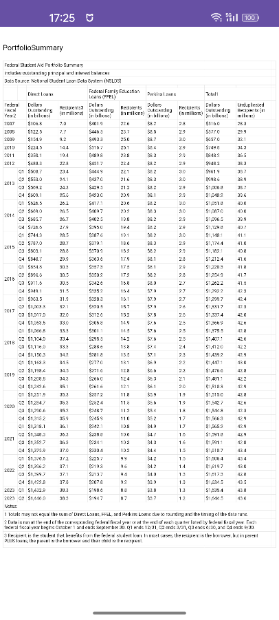
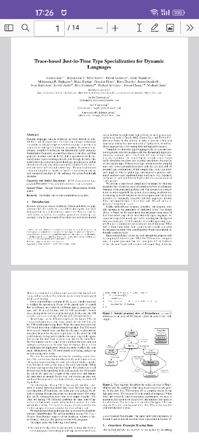
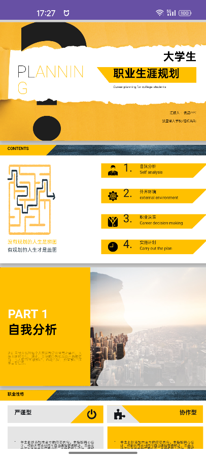
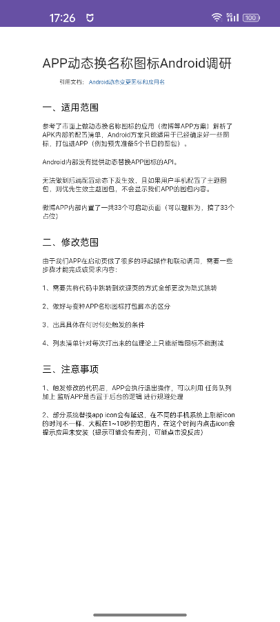

# AndroidDocViewer

English | [简体中文](README.md)

[](https://jitpack.io/#seapeak233/AndroidDocViewer)

Android Local Document Preview Solution

## 🎉 Latest Update

### New Activity Launch Method
Don't want to wrap your own Activity? Now you can use `DocViewerActivity` directly:
- Launch preview with one line of code
- Automatic file type detection
- Built-in title bar, back button, and more menu
- Support for third-party app opening and local download
- Customizable title bar color and feature toggles

## Project Background

Since Tencent X5's TBSReader became a paid service, finding a viable native offline document preview solution has become a challenge. After research, it was found that various native solutions have different limitations.

In contrast, the JavaScript ecosystem has more mature solutions for document preview, and WebView naturally supports interactive behaviors like zooming, which can significantly reduce the development workload of native gesture handling.

**Core Idea**: Package mature JavaScript document preview solutions as HTML + CSS + JS, store them in the Android assets directory, and implement document preview by loading local resources through WebView.

## Features

### 🆕 New Activity Direct Launch
- No need to manually create Fragment and Activity containers
- Automatically select previewer based on file extension
- Support for title bar color, function buttons, and other configurations
- Built-in third-party app opening and document download functions

### Supported Document Formats
- **PDF** - Based on PDF.js, supports zoom and pagination
- **Word** (.docx) - Based on docxjs, maintains original format
- **PowerPoint** (.pptx) - Based on pptx-preview, supports animation effects
- **Excel** (.xlsx) - Based on SheetJS, supports multiple worksheets
- **TXT** - Plain text preview, supports automatic encoding detection
- **Markdown** - Based on markdown-it, supports syntax highlighting

### Integration Methods
- ✅ **Activity Direct Launch** (Recommended, focus of this update)
- ✅ **Fragment Container**
- ⏳ View Component (Planned)

## Quick Start

### Add Dependency

```gradle
implementation 'com.github.seapeak233:AndroidDocViewer:<Tag>'
```

### 🚀 Minimal Usage (Recommended)

Launch document preview with just one line of code:

```kotlin
// Automatically detect file type and launch preview
DocViewerActivity.startWithFile(context, "/path/to/document.pdf", "My PDF Document")
```

### Basic Usage

#### Method 1: Activity Direct Launch 🆕

```kotlin
// 1. Quick launch (Recommended)
DocViewerActivity.startWithFile(context, "/storage/emulated/0/Download/report.xlsx", "Monthly Report")

// 2. Launch with DocConfig
val docConfig = DocConfig("file:///android_asset/sample.docx", DocType.WORD)
DocViewerActivity.start(context, docConfig, "Word Document")

// 3. Create config from file path
val docConfig = DocConfig.fromFile("/path/to/presentation.pptx")
DocViewerActivity.start(context, docConfig!!, "Presentation")
```

#### Method 2: Fragment Embedding

```kotlin
val config = DocConfig("file:///android_asset/sample.xlsx", DocType.EXCEL)
val fragment = DocViewerFragment.newInstance(config)

supportFragmentManager.beginTransaction()
    .replace(R.id.container, fragment)
    .commit()
```

## 🎨 Customization

### Custom Theme Styling

```kotlin
val docConfig = DocConfig.fromFile("/path/to/document.pdf")!!

val pageConfig = DocPageConfig(
    docConfig = docConfig,
    title = "Enterprise Document Preview",
    statusBarColor = Color.parseColor("#FF2196F3"),    // Status bar color
    toolbarColor = Color.parseColor("#FF2196F3"),      // Toolbar color
    titleTextColor = Color.WHITE,                      // Title text color
    iconTintColor = Color.WHITE,                       // Icon tint color
    showBackButton = true,                             // Show back button
    showMoreMenu = true,                               // Show more menu
    enableThirdPartyOpen = true,                       // Enable third-party app opening
    enableDownload = true,                             // Enable download function
    downloadToPublicDir = true                         // Download to public Download folder
)

DocViewerActivity.start(context, pageConfig)
```

### Quick Configuration

```kotlin
val docConfig = DocConfig.fromFile("/path/to/document.pdf")!!

// Dark theme
val darkConfig = DocPageConfig.createDarkTheme(docConfig, "Document Preview")
DocViewerActivity.start(context, darkConfig)

// Light theme
val lightConfig = DocPageConfig.createLightTheme(docConfig, "Document Preview")
DocViewerActivity.start(context, lightConfig)

// Simple mode (no more menu)
val simpleConfig = DocPageConfig.createSimple(docConfig, "Read-only Document")
DocViewerActivity.start(context, simpleConfig)
```

### Configuration Options

| Option | Description | Default |
|--------|-------------|---------|
| `title` | Title bar text | Auto-generated based on document type |
| `statusBarColor` | Status bar background color | `#FF6200EE` |
| `toolbarColor` | Toolbar background color | `#FF6200EE` |
| `titleTextColor` | Title text color | `Color.WHITE` |
| `iconTintColor` | Icon tint color | `Color.WHITE` |
| `showBackButton` | Show back button | `true` |
| `showMoreMenu` | Show more menu | `true` |
| `enableThirdPartyOpen` | Enable third-party app opening | `true` |
| `enableDownload` | Enable download function | `true` |
| `downloadToPublicDir` | Download location | `true` (Download folder) |

## 📋 Usage Examples

### Scenario 1: Enterprise Document Management (Disable Download and Sharing)

```kotlin
val pageConfig = DocPageConfig(
    docConfig = DocConfig.fromFile("/path/to/confidential.pdf")!!,
    title = "Confidential Document",
    showMoreMenu = false,           // Hide more menu
    enableThirdPartyOpen = false,   // Disable third-party opening
    enableDownload = false          // Disable download
)
DocViewerActivity.start(context, pageConfig)
```

### Scenario 2: Local File Preview

```kotlin
// Preview locally downloaded file
val localFile = "/storage/emulated/0/Download/report.xlsx"
DocViewerActivity.startWithFile(context, localFile, "Local Report")
```

### Scenario 3: In-App Help Documentation

```kotlin
// Load Markdown help document from assets
val docConfig = DocConfig.fromAssets("help.md", DocType.MARKDOWN)
val pageConfig = DocPageConfig.createSimple(docConfig, "User Guide")
DocViewerActivity.start(context, pageConfig)
```

### Scenario 4: Custom Brand Color

```kotlin
val pageConfig = DocPageConfig(
    docConfig = docConfig,
    title = "Brand Document",
    statusBarColor = Color.parseColor("#FF9C27B0"),  // Brand purple
    toolbarColor = Color.parseColor("#FF9C27B0"),
    titleTextColor = Color.WHITE,
    iconTintColor = Color.WHITE
)
DocViewerActivity.start(context, pageConfig)
```

## 📖 Supported Document Types

| Document Type | Enum Value | Supported Extensions | Notes |
|---------------|------------|---------------------|-------|
| PDF | `DocType.PDF` | .pdf | Supports zoom and pagination |
| Word | `DocType.WORD` | .doc, .docx | Maintains original format |
| Excel | `DocType.EXCEL` | .xls, .xlsx | Supports multiple worksheets |
| PowerPoint | `DocType.PPT` | .ppt, .pptx | Supports animation effects |
| Text | `DocType.TXT` | .txt | Automatic encoding detection |
| Markdown | `DocType.MARKDOWN` | .md | Supports syntax highlighting |

## 💡 More Examples

For complete usage examples, please refer to:
- [MainActivity](https://github.com/seapeak233/AndroidDocViewer/blob/main/app/src/main/java/com/seapeak/example/MainActivity.kt) - Fragment usage example
- [PreviewActivity](https://github.com/seapeak233/AndroidDocViewer/blob/main/app/src/main/java/com/seapeak/example/PreviewActivity.kt) - Activity usage example
- [ActivityUsageExample](https://github.com/seapeak233/AndroidDocViewer/blob/main/docviewer/src/main/java/com/seapeak/docviewer/example/ActivityUsageExample.kt) - Complete code examples for various scenarios

## Preview Screenshots

| Excel | PDF |
|-------|-----|
|  |  |

| PowerPoint | Word |
|------------|------|
|  |  |

## Version Updates

### Latest Version
- Added `DocViewerActivity` direct launch method
- Added `DocPageConfig` page configuration options
- Added third-party app opening function
- Added document download to local function
- Optimized automatic file type detection

### Migration Guide
The previous Fragment-based approach is still supported. Now you can choose the simpler Activity approach:

```kotlin
// Previous method (still supported)
val fragment = DocViewerFragment.newInstance(docConfig)

// New method
DocViewerActivity.startWithFile(context, filePath, title)
```

## 🛠 Technical Dependencies

This project is built on the following excellent open-source projects:

| Component | Purpose | Version | Repository |
|-----------|---------|---------|------------|
| SheetJS | Excel file parsing | 0.20.3 | [GitHub](https://github.com/SheetJS/sheetjs) |
| PDF.js | PDF file rendering | 4.0.269 | [GitHub](https://github.com/mozilla/pdf.js) |
| pptx-preview | PowerPoint preview | 1.0.6 | [GitHub](https://github.com/501351981/pptx-preview) |
| docxjs | Word document parsing | 0.3.6 | [GitHub](https://github.com/VolodymyrBaydalka/docxjs) |
| markdown-it | Markdown rendering | 14.1.0 | [GitHub](https://github.com/markdown-it/markdown-it) |

## License

This project is licensed under an open-source license. Please see the [LICENSE](LICENSE) file for details.

